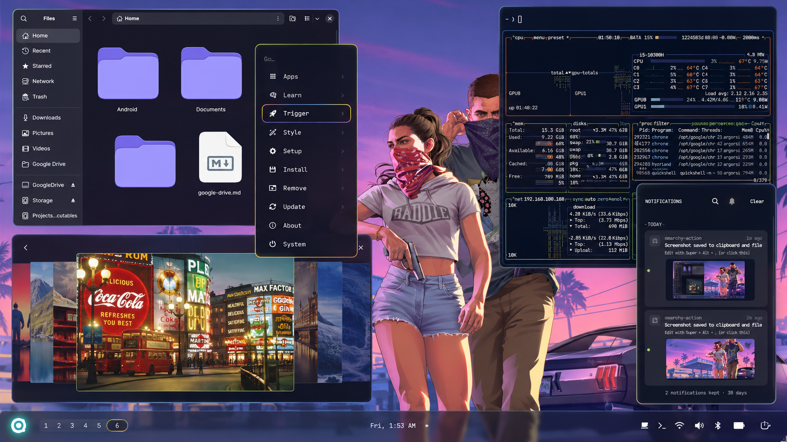

# Frosted Signal — an Omarchy theme



A dark, glassy Omarchy theme: deep indigo night, frosted translucent surfaces
everywhere a panel or popup appears, and one signal color — acid green,
shifting through amber into indigo — reserved for whatever currently has
focus. Nothing is red until something has actually gone wrong.

## Install

```bash
omarchy theme install https://github.com/imargorsi/Frosted-Signal-Theme
```

## What's included

- **A growing wallpaper collection** in `backgrounds/` — glass/abstract art,
  sci-fi key art, and a few classics, rotated automatically (see below)
- **A Hyprland 0.55+ Lua treatment**: 10 px soft rounding, a frosted blur,
  interpolated motion curves, and a three-stop green → amber → indigo border
  that rotates continuously on the focused window
- **Coordinated Omarchy surfaces**: shell bar and popups, launcher, menus,
  notifications, polkit, lock screen, image picker, GTK, and the screen-share
  picker
- **Terminals**: Alacritty, Foot, Kitty, Ghostty
- **Editors and tools**: Neovim (Aether), VS Code / VSCodium / Cursor, Helix,
  Zellij, btop, Obsidian, Pi, gum, SwayOSD, mako
- **A standalone Base24 palette** for anything else you want to match

## Palette

| Role | Colour | Name |
| --- | --- | --- |
| background | `#0B0E20` | Frost Night |
| surface | `#171B38` | Glass Shadow |
| selection | `#272B5E` | Signal Field |
| comment / muted | `#6E70A8` | Cold Haze |
| foreground | `#DCD4BC` | Bone |
| bright foreground | `#FBFBF4` | Poster White |
| **accent** | `#A8BE4A` | **Signal Green** |
| red / error | `#C85234` | Fault Rust |
| orange / action | `#E07B2C` | Ember |
| yellow / warning | `#E6B14A` | Warm Amber |
| green / success | `#8CAE3E` | Clear Green |
| cyan / info | `#7FA3DC` | Glass Light |
| blue / structure | `#6E72C6` | Cool Indigo |
| magenta / keyword | `#8B67C0` | Shift Violet |
| cursor | `#F6D26C` | Beacon Amber |

Semantic roles in `colors.toml` are the source of truth; `color0`–`color15`
mirror them for older integrations.

## Wallpapers

[`backgrounds/`](backgrounds/) holds the theme's wallpaper set — not a fixed
curated set, but a folder you keep adding to. Drop any `.jpg`/`.jpeg`/`.png`/
`.gif`/`.bmp`/`.webp` in there (or in the per-machine overlay at
`~/.config/omarchy/backgrounds/frosted-signal/`, which survives a theme
refresh) and it's picked up automatically — no re-registration needed.

**Automatic rotation:** a systemd user timer
(`omarchy-wallpaper-rotate.timer`) calls `omarchy theme bg next` once an
hour, cycling through every image in `backgrounds/` in sorted order and
wrapping back to the start. Check on it or change the interval:

```bash
systemctl --user status omarchy-wallpaper-rotate.timer
systemctl --user edit omarchy-wallpaper-rotate.timer   # change OnUnitActiveSec
systemctl --user stop omarchy-wallpaper-rotate.timer    # pause rotation
```

Cycle manually any time with `omarchy theme bg next`, or pick a specific
image with `omarchy theme bg set <path>`.

## Integration notes

Omarchy applies the palette, shell, Hyprland, wallpaper, terminal, and generated
app themes when the theme is selected.

One thing worth knowing about **`omarchy theme install`**: a theme cloned from a
repository has its executable files stripped and regenerated from `colors.toml`.
That covers every `*.lua` (so `hyprland.lua` and `gum_env.lua`), the four
terminal configs, and `vscode.json`. The colours survive — but the authored
Hyprland art direction in `hyprland.lua` (the rotating border, the blur and
motion curves, the window rules) does **not**. To keep it, place the theme
directly under `~/.config/omarchy/themes/` instead, where a theme you placed
yourself is unrestricted.

`gtk.css`, `helix.toml`, `zellij.kdl`, `obsidian.css`, the Base24 palette, and
the standalone `vscode-extension/` package are optional assets. They need the
corresponding application plus an app-specific import or manual installation;
their presence in the theme directory alone does not activate them.

## Licence

[MIT](LICENSE).
